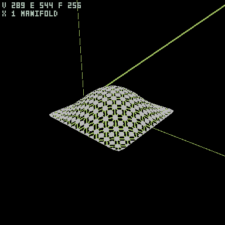
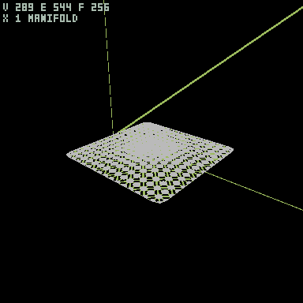
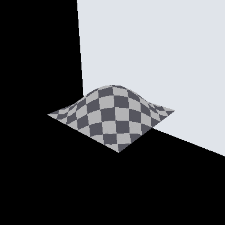
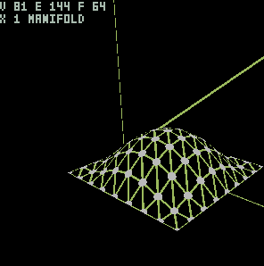
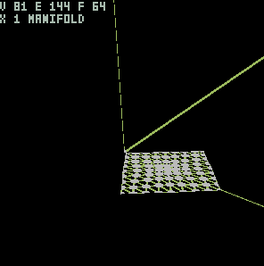
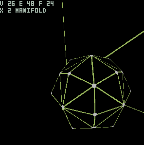
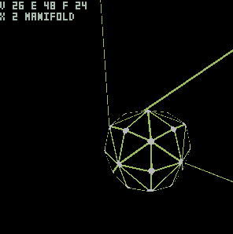
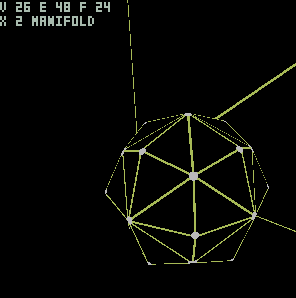
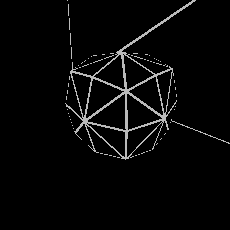

# Foundation A (Remesh / Sparse Solver) — Implementation Log 📈

> A **living document** tracking implementation progress of the remesh stack in eris-renderer's `scene::mesh`
> (Foundation A = sparse SPD solver and its precursors).
> To update, **append one block under "## Log" below** — no new files or issues per milestone. Newest on top.
>
> - Decision of record: [`discussion/2026-06-21-remesh-roadmap.md`](../discussion/2026-06-21-remesh-roadmap.md) (three-layer map A/A′/B + injectivity backbone, D1–D14)
> - Source of truth for implementation status: [eris-renderer STATUS.md §4.5](https://github.com/eris-ths/eris-renderer/blob/main/docs/reference/STATUS.md) (this log is a summary; details live there)
> - Survey: [MESH-EDITING-LANDSCAPE-SURVEY.md §13](https://github.com/eris-ths/eris-renderer/blob/main/docs/design/MESH-EDITING-LANDSCAPE-SURVEY.md) (near-term stack and sequencing)

**Screenshots**: modeling-heavy work, so CAD-style wireframe (`mode=preview:wire-cad` — black background, primary-color
edges, emphasized vertex points, optional V/E/F/χ HUD) is the default. No beauty path-traced shots.

## Entry template

```
### YYYY-MM-DD · <title>

- **Layer**: <A precursor / A core / B / QEM>
  - <one-line summary>
- **What**
  - <1–2 lines>
- **Source**
  - <paper + equation numbers, or —>
- **Verify**
  - <tests / live run / measurements>
- **Next**
  - <next step>
- **Ref**
  - eris-renderer `<sha>` · STATUS §4.5
```

---

## Log

### 2026-06-21 · Cotangent curvature-flow smoothing (intrinsic-Delaunay robustness stack)

| before (subdivided dome) | after (+ cotangent curvature flow) |
|---|---|
|  |  |

> CAD wireframe of a subdivided `dome` patch. The HUD (`V 289 E 544 F 256 / X 1 MANIFOLD`) is identical — topology
> preserved — and the fixed boundary keeps the patch from shrinking, while the curvature flow flattens the central
> bump (the silhouette's top edge drops ~10px). Unlike the uniform-weight (graph-Laplacian) smoother, this one is
> geometry-aware: the weights depend on edge lengths, so it stays correct on uneven triangulations.
> Repro: `--ui` → `reset dome` → `/mesh?subdiv=1` (before) / `/mesh?subdiv=1&cot=0.5:2` (after) → `/frame?mode=preview:wire-cad&scene=modeler`.

- **Layer**: A (cotangent track — the negative-weight robustness backbone, now complete)
  - The cotangent Laplacian is the geometry-aware operator the whole smoothing/parameterization stack eventually
    wants. Its weights go negative on obtuse triangles, which breaks SPD and folds faces. This entry lands the
    three-stage fix and rides it into a working curvature-flow smoother.
- **What**
  - Stage 1 — **intrinsic mollification**: add one uniform offset to every edge length so all triangles satisfy the
    triangle inequality with a margin (degeneracy/NaN guard; connectivity and vertices untouched).
  - Stage 2 — **intrinsic Delaunay flips**: flip edges on the intrinsic metric (vertices fixed) until every interior
    edge is Delaunay (`cot α + cot β ≥ 0`). By Bobenko-Springborn Prop. 17 this makes the cotan weights non-negative,
    so the Laplacian is SPD again. Flip lengths come from a 2D unfolding (`‖p1 − p3‖`), not the trig closed form
    (which is the usual reconstruction bug); non-convex diamonds are rejected.
  - Stage 3 — **cotangent curvature flow**: solve `(M − t·L_c) X = M X^n` (backward Euler, unconditionally stable)
    per axis with the existing Jacobi-PCG, mollifying and flipping each pass. Boundary vertices are Dirichlet-fixed.
- **Source**
  - Mollification: Sharp & Crane, *A Laplacian for Nonmanifold Triangle Meshes* (SGP 2020). iDT: Bobenko & Springborn
    2007; Fisher/Springborn/Schröder/Bobenko 2007. Curvature flow / mass matrix: Desbrun et al. (SIGGRAPH 1999),
    Meyer et al. 2003. All formulas verified verbatim against the primary PDFs before coding; the survey that holds
    them (with the per-source disagreements flagged) is the source of truth, not memory.
  - One trap worth recording: the mollification margin δ is quoted as 1e-4, 1e-5, **and** 1e-6 × mean-edge-length by
    the paper, the course notes, and the reference library respectively — three primary sources, three values. We
    chose the course's 1e-5·h and cited it rather than guessing.
- **Verify**
  - Stage tests, expected values from the survey's checklist: equilateral shared-edge weight = `1/√3` exactly (pins
    the cotan formula, sign, and which edge is "opposite"); a stretched grid full of obtuse triangles becomes
    all-non-negative-weight after flipping (the Prop. 17 guarantee, checked numerically); flips are idempotent on a
    second pass (termination); the flow is unconditionally stable at `t = 100 × 5 passes`; `L·1 = 0`, symmetry, and
    bit-determinism throughout. Full suite 320 green, zero warnings.
  - A determinism bug surfaced and was fixed honestly: the weight map iterated a hash map, so floating sums differed
    by 2 ULP between runs — sorting the edge keys restored bit-identical output.
- **Next**
  - Voronoi mixed mass (currently barycentric); a `cot` vs uniform side-by-side on a deliberately uneven mesh; the
    tufted cover (stage 3 of robustness, for boundary/non-manifold) when those inputs actually arrive.
- **Ref**
  - eris-renderer (branch `claude/mesh-taubin-smoothing`) · STATUS §4.5 (rows 内在幾何 ①②③) · design/COTANGENT-ROBUSTNESS-SURVEY.md

### 2026-06-21 · UV checker bake (parameterization → bake)



> A checker pattern baked into the LSCM UV of the `dome` patch and shown on the 3D surface (ambient-occlusion
> preview). Because LSCM is conformal — it preserves angles — the checker stays square almost everywhere; where the
> surface curves up (the bump in the middle) the cells stretch, which is exactly the **area distortion** a conformal
> map trades away to keep angles. So the checker is a direct readout of the parameterization quality.
> Repro: `--ui` → `reset dome` → `/mesh?lscm=checker` → `/frame?mode=preview:ao&scene=modeler`.

- **Layer**: A (solver application #2 — bake stage)
  - Completes the AI-first core loop: **declare → parameterize → UV → bake**. The previous entry produced the UV;
    this one consumes it, so an agent with no eyes can now lay a texture on a generated surface and *see* the
    distortion as a number-free picture.
- **What**
  - `Mesh::tessellate_lscm(mat)`: bakes the LSCM UV into `Tri::new_uv`, normalized to `[0,1]²` (aspect-preserving),
    so a UV-space pattern lays down uniformly.
  - `ProcTex::CheckerUV { a, b, scale }`: a checker cut in UV space — a separate variant from the existing
    world-space `Checker` (which cuts on `p.xz`), so nothing existing changes. The renderer already routes per-hit
    UV through `albedo_at`, so every integrator picks it up on one path.
  - The Flat/AO previews now read `albedo_at` (procedural textures included) instead of the raw material albedo, so
    baked patterns are visible without a full path trace.
- **Source**
  - Same LSCM map as the prior entry (Lévy 2002). The conformal/area-distortion reading is the defining property of
    conformal maps — angle-preserving, not area-preserving.
- **Verify**
  - Tests: baked UVs lie in `[0,1]²`; a planar patch stays angle-preserving after baking; determinism. Full suite
    304 green, zero warnings. Live: `dome` shows square cells that stretch over the curved bump.
- **Next**
  - Automatic seams (UV for closed meshes, which need a cut graph first); then the cotangent / cross-field track.
- **Ref**
  - eris-renderer (branch `claude/mesh-taubin-smoothing`) · STATUS §4.5 (row M4.2 LSCM bake)

### 2026-06-21 · LSCM UV unwrapping

| dome (curved disk patch, 3D) | LSCM-flattened atlas |
|---|---|
|  |  |

> A curved open patch (`dome` seed) unwrapped to a flat 2D atlas by least-squares conformal mapping. CAD wireframe;
> the HUD (`V 81 E 144 F 64 / χ 1 MANIFOLD`) is identical — same topology, just laid flat. The grid spacing in the
> atlas reflects the conformal map (angle-preserving), so the squares stay near-square.
> Repro: `--ui` → `reset dome` → `/frame?mode=preview:wire-cad&scene=modeler` (3D) / `/mesh?lscm=flat` then same frame (atlas).

- **Layer**: A (solver application #2)
  - UV unwrap — the second use of the sparse solver, and half of the AI-first core feature (declare → parameterize
    → UV → bake).
- **What**
  - `Mesh::lscm_uv()`: least-squares conformal map. Per triangle, project to a local orthonormal frame, form the
    complex coefficients W (edge vectors), and assemble the normal equations `AᵀA`, `Aᵀb` directly (transpose-free,
    FEM-style rank-1 accumulation), then solve with Jacobi-PCG. Two vertices pinned (ends of an approximate graph
    diameter).
  - `AᵀA` is SPD once ≥2 vertices are pinned, so LSCM rides the existing solver **without** needing the cotangent
    robustness backbone — that was the reason to do LSCM before geometry-aware (cotangent) smoothing.
  - `/mesh?lscm=flat` shows the flattened atlas in the CAD wireframe; `dome` is a new open-patch test surface.
- **Source**
  - Lévy, Petitjean, Ray, Maillot, *Least Squares Conformal Maps for Automatic Texture Atlas Generation*
    (SIGGRAPH 2002), §2.4–2.6: `W_j` = local edge vectors as complex numbers, `C(T) = (1/dT)|Σ_j W_j U_j|²`,
    solution `x = (AᵀA)⁻¹ Aᵀb`, `AᵀA` SPD for ≥2 pins. Verified verbatim against the paper.
- **Verify**
  - 4 tests: **planar patch is conformal — per-triangle angles preserved to max_err < 1e-6** (the core correctness
    check); pinned vertices land exactly; determinism; a bent (non-planar) patch converges. Full suite 303 green,
    zero warnings. Live: `dome` (a curved disk patch) unwraps to a flat atlas with topology preserved.
- **Next**
  - Bake a checker into the UV to visualize distortion on the 3D surface; automatic seams (for closed meshes); then
    the cotangent / cross-field track.
- **Ref**
  - eris-renderer `f44a6b7` · STATUS §4.5 (row M4.2 LSCM UV)

### 2026-06-21 · Sparse SPD solver + implicit smoothing

| before (subdivision only) | after (+ implicit smoothing) |
|---|---|
|  |  |

> CAD wireframe of a subdivided box. The HUD (`V 26 E 48 F 24 / χ 2 MANIFOLD`) is identical in both — topology is
> preserved — while implicit smoothing rounds the corners by *solving a linear system* (not iterating). Unlike
> Taubin, implicit smoothing shrinks (it diffuses toward the centroid), so this uses a gentle strength.
> Repro: `--ui` → `reset box` → `/mesh?subdiv=1` (before) / `/mesh?subdiv=1&ismooth=0.5` (after) → `/frame?mode=preview:wire-cad&scene=modeler`.

- **Layer**: A (core keystone + first application)
  - The zero-dependency sparse SPD solver — the piece the whole stack hangs on — plus its first real use.
- **What**
  - `core::sparse`: CSR matrix (triplet→CSR with duplicate accumulation, SpMV, diagonal extraction) +
    conjugate gradient and Jacobi-preconditioned CG. Fixed iteration order → bit-exact determinism.
  - `Mesh::implicit_smooth(λ, passes)`: solve `(I + λ L_g) X = X_prev` per axis with Jacobi-PCG, where
    `L_g = D − A` is the (symmetric, PSD) graph Laplacian — so `(I + λ L_g)` is SPD and CG applies directly.
  - This is the keystone the survey calls out: implicit smoothing, LSCM UV, cross-field smoothing, and
    parameterization relaxation all reduce to sparse SPD systems, so one solver unlocks all four.
- **Source**
  - CG: Shewchuk, *An Introduction to the Conjugate Gradient Method Without the Agonizing Pain* (1994).
  - Implicit fairing: Desbrun, Meyer, Schröder, Barr, *Implicit Fairing of Irregular Meshes* (SIGGRAPH '99),
    backward Euler `(I − λdt L) X^{n+1} = X^n`, **unconditionally stable**. Their umbrella operator is
    `1/d_i`-normalized (asymmetric) → we use the symmetric unnormalized version so CG applies. Anisotropic
    cotangent (§5) is the next step — it needs negative-weight robustness (mollification / intrinsic Delaunay).
- **Verify**
  - Solver: 7 tests (SpMV vs dense; triplet accumulation; 2×2 known solution in ≤2 iterations; 1D Poisson
    residual <1e-8 with symmetric solution; random SPD recovery; Jacobi-PCG same solution but faster; determinism).
  - Smoothing: 6 tests (topology preserved; roughness halved; **unconditional stability — λ=50 × 5 passes, no
    blow-up**, unlike explicit Taubin; boundary fixed; determinism; spec parse). Full suite 299 green, zero warnings.
- **Next**
  - Anisotropic **cotangent** Laplacian (geometry-aware smoothing / curvature flow), then **LSCM UV** — both ride
    the same solver. Cotangent first needs the negative-weight robustness layer (mollification / iDT).
- **Ref**
  - eris-renderer `fc11665` (solver), `7aecafb` (implicit smoothing) · STATUS §4.5 (rows sparse solver, implicit smooth)

### 2026-06-21 · Taubin λ|μ smoothing

| before (subdivision only) | after (+ Taubin, 25 steps) |
|---|---|
|  |  |

> CAD wireframe of a subdivided box (subdiv=1). The HUD (`V 26 E 48 F 24 / χ 2 MANIFOLD`) is identical in both
> shots — Taubin only moves vertices, so the topology is preserved — yet the angular silhouette rounds out.
> Repro: `--ui` → `reset box` → `/mesh?subdiv=1` (before) / `/mesh?subdiv=1&taubin=25` (after) → `/frame?mode=preview:wire-cad&scene=modeler`.

- **Layer**: A (precursor)
  - Non-shrinking Laplacian smoothing, shipped *before* the sparse solver.
- **What**
  - Alternate a λ shrink step and a μ inflate step so shrinkage cancels while high-frequency noise is removed.
  - Needs only the 1-ring (already in the half-edge mesh) — no solver required.
  - A pure `&self → Mesh` modifier, `/mesh?taubin=N`. Boundary vertices pinned, equal weights `w_ij = 1/|i*|`,
    Jacobi update for bit-exact determinism.
- **Source**
  - Verified verbatim against Taubin, *Geometric Signal Processing on Polygonal Meshes* (EUROGRAPHICS 2000 STAR).
  - Transfer `f(k) = (1−λk)(1−μk)`, pass-band `k_PB = 1/λ + 1/μ`, recommended **λ = 0.6307 / μ = −0.6732 /
    k_PB = 0.1**, boundary fixed (§2). Coefficients from the paper, not memory.
- **Verify**
  - 7 unit tests green (topology preserved; non-shrinking under half the shrinkage of plain Laplacian; roughness
    halved on a noised sphere; boundary fixed; identity at 0 passes; determinism; spec parse).
  - Full suite 286 green, zero warnings. Live (torus): vertices move, topology fully preserved (genus 1,
    valence-4 ×512), bit-identical across runs.
  - Misdiagnosis corrected: a bbox-shrink metric grew on a subdivided cube → switched to a Laplacian-magnitude
    roughness metric.
- **Next**
  - Jacobi-PCG for the **sparse solver core** (implicit smoothing → LSCM UV → stage-1 convex cross field), with
    QEM decimation in parallel.
- **Ref**
  - eris-renderer `0e77a5d` · STATUS §4.5 (row M4.2 taubin)
